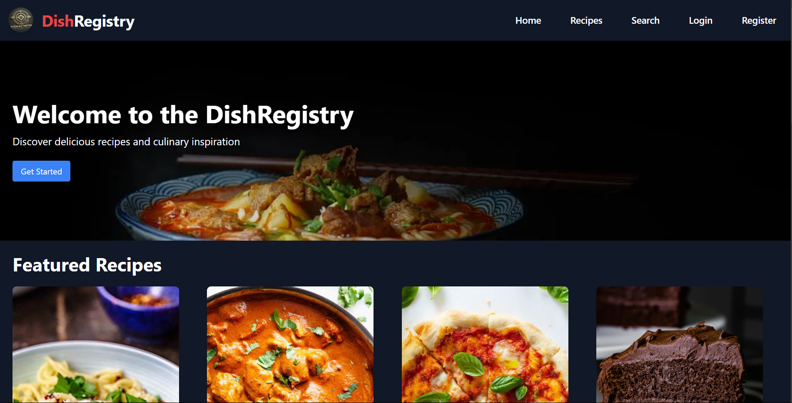

# DishRegistry

DishRegistry is your ultimate destination for discovering, sharing, and organizing recipes from around the world. Whether you’re looking for quick weeknight meals or gourmet dishes to impress, our platform offers a vast, curated collection of recipes tailored to all tastes and preferences. With easy search options, a personal recipe organizer, and the ability to save and rate your favorite dishes, DishRegistry helps you create your perfect culinary archive. Join our community of food lovers today and start your journey toward flavorful, hassle-free cooking!


## Authors

- [Byte-Kamal](https://github.com/Byte-Kamal)


## How to use?

- Register your profile from the register view
- Login using the same data as register
- Home Page for viewing latest recipe and featured recipe
- Recipes for Getting all the recipes
- View search to search for recipe based on title, category, tag and ingredients
- View Profile from navbar for viewing profile details and edit profile and no profile for non-authenticated users
- View Dashboard for work based on role non-authenticated user and authenticated user group are not-allowed for dashboard view


## Screenshots

### Home Page

### Recipes
 
### Search Results

### Login

### Register


## License

[MIT](https://choosealicense.com/licenses/mit/)


## Installation

Setup poetry environment and django for backend and react for frontend.

```bash
  # Backend Installation
    # Environment Setup and Adding Dependency
    mkdir backend
    cd backend
    poetry init
    poetry shell
    poetry add django djangorestframework
    # Project Setup
    django-admin startproject dishregistry .

  # Frontend Installation
    mkdir frontend
    cd frontend
    npx create-react-app .

  # Tailwindcss Setup
    npm install tailwindcss postcss autoprefixer
    npx init tailwindcss
```


## Feedback

If you have any feedback, please reach out to us at kdhital132@gmail.com


## Features

- Dark mode user friendly
- Search Recipe using Title, Category, Tags, Ingredients
- Different Dashboard view for different user group for recipe management, user management and meal planner management
- Proper Response while login and Register


## Deployment

To deploy this project run

```bash
  # for frontend  
    npm run
  # for backend
    python manage.py runserver
```


